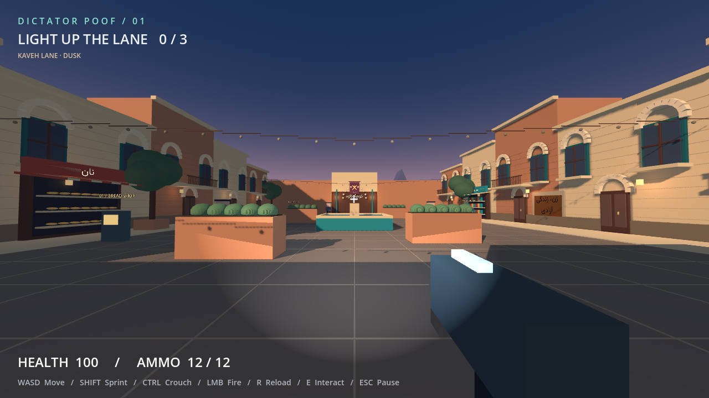

# Dictator Poof

**A night on Kaveh Lane. Bring back the light.**

A first-person resistance game set in a fictional Iranian neighborhood.
The playable opening is now outdoors: brick homes, balconies, shops, Persian
graffiti, a fountain, and friends waiting in a courtyard.

Restore the three amber power boxes, then return to the speaker beside the
rug near your starting point. Each restored box lights nearby homes and heals
25 health. Evade or fight the patrols. After winning, choose **Join your
friends** to explore the lit street, or **Replay the night** to start again.

## Play

Import `project.godot` into **Godot 4.7.2 Standard**, then press **F5**.
No .NET SDK or export is needed.

| Control | Action |
| --- | --- |
| WASD / mouse | Move / look |
| Shift / Ctrl / Space | Sprint / crouch / jump |
| Left click / R | Fire / reload |
| E | Use a power box, speak to a friend, or start the gathering |
| Esc | Pause / resume |

The menu offers sound, blood, and sensitivity settings. The neighborhood is
still a stylized prototype: simple characters, geometry, and synthesized
music. It is not a finished realistic city or a completed historical campaign.

## Contribute

To contribute, fork this repository, create a branch in your fork, and submit
a pull request to this repository. Collaborators with write access may create
a branch here directly. See [CONTRIBUTING.md](CONTRIBUTING.md) for guidelines.

Example contribution: add another graffiti slogan.
Open `scenes/graffiti_wall.tscn`, duplicate the **Slogan** node, and give the
new node a descriptive name. Edit its **Text** in the Inspector, then adjust
its position and font size so both slogans fit on the wall without overlapping.
Keep the Persian language and right-to-left settings, and enter Persian text
in reading order; do not reverse it. You can write in other languages, as well. Save, open `scenes/graffiti_preview.tscn`,
and press **F6** to check the result. Include the slogan's meaning and any
historical source in your pull request.

For other contributions, the neighborhood is built in `scripts/world.gd`.
Mission state lives in `scripts/game.gd`, movement in `scripts/player.gd`,
and patrol behavior in `scripts/guard.gd`.

The greatest source of inspiration for this project comes from *[docs/Iran WORLDBUILDING.md](docs/IRAN%20WORLDBUILDING.md)*.

[Story and creative direction](docs/STORY.md) · [Iran references](docs/RESEARCH.md)

## License and project identity

Original source code is licensed under [GPL-3.0-or-later](LICENSE). The
project was founded and is directed by **Autrin Hakimi**. Original documentation
and procedural art use the same license unless otherwise identified. Preserve
applicable copyright, license, and warranty notices when redistributing; see
[NOTICE](NOTICE) for scope and distribution requirements, including the
mandatory preservation of copyright and author attribution under GPLv3
section 7(b). Separate releases under different names are allowed, but must
retain credit for Autrin Hakimi and contributors in their accompanying notices.
Avoid implying official
endorsement of modified releases; see [TRADEMARKS.md](TRADEMARKS.md).
Contributors are welcome and credited in [CONTRIBUTORS.md](CONTRIBUTORS.md).
For optional reuse credit, see [CITATION.cff](CITATION.cff).

## Checks

With Godot on PATH:

```sh
godot --headless --path . --editor --import --quit
godot --headless --path . --script tests/smoke.gd
```

Tested on Windows with Godot 4.7.2: integration checks pass for movement,
combat, reachable power boxes, lighting, victory, peaceful exploration,
pause, and replay. Rendered views were inspected on an RTX 4070 Laptop GPU.
A full manual playthrough and performance benchmark remain to be done.

## Credits

Original code and procedural art: [GPL-3.0-or-later](LICENSE).
Bundled Persian font: [Vazirmatn, SIL OFL 1.1](assets/fonts/vazirmatn/OFL.txt),
by the Vazirmatn Project Authors. [Source and credits](assets/fonts/vazirmatn/README.md).
The existing face image in `assets/textures/faces/` is separate from these
original assets; its provenance/license needs recording before distribution.
See [THIRD_PARTY_NOTICES.md](THIRD_PARTY_NOTICES.md) for the asset inventory
and release requirements, including Godot engine attribution for exported games.
